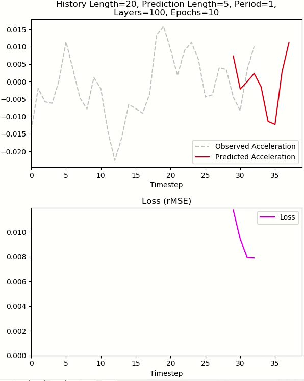

# OnlineMLP


A continually trained multilayer perceptron (MLP) model for performing real-time predictions on non-stationary time
series datasets, powered by Keras. [Funded
by the National Science Foundation](https://www.nsf.gov/awardsearch/showAward?AWD_ID=1937535&HistoricalAwards=false).


To install dependencies (preferably in something like a `venv` or `conda` environment):

```pip install -r requirements.txt```

To perform a benchmark, run: 

```python -m bench```

This will output a comma-separated list of 9 values. The first 4 consist of the model's configuration corresponding to
the ordering of their command line options shown below, and the last 5 are the model's intermediary RMSE scores taken at
1/5, 2/5, 3/5, 4/5, and the end of the dataset.

Command line options:

- `-l`/`--history-length`: The number of past timesteps to use for making a prediction. (default: 20)
- `-f`/`--forecast-length`: The number of timesteps ahead to make a prediction at. (default: 5)
- `-u`/`--units`: The number of units in the MLP\'s hidden layer. A list of integers separated by spaces can also be
provided to specify additional layers. (default: 10)
- `-e`/`--epochs`: The number of epochs to spend training the model. (default: 10)

Note the data must be of `.csv` format and have two columns named `Time` and `Observation` for this script to work
properly.

---

To carry out a parameter sweep on an HPC cluster that supports `slurm` (like, for instance, `hyperion` at UofSC):

```sbatch sweep.sh```

changing any parameter bounds by directly modifying `sweep.sh` as needed. To benchmark an offline MLP for means of
comparison, run `sbatch offline-bench/sweep.sh`.

---

To see a live demo of the MLP training in real-time, checkout the `live-demo` branch.
